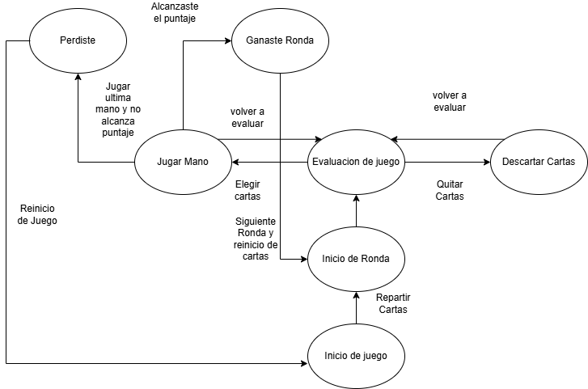

# Malatro

## About

`Malatro` is a simplified clone of the game `Balatro`.
Its main purpose is to serve as an educational tool, teaching foundational programming concepts.

📢 **Note**: This project is purely educational and will not be used for any commercial purposes.

---

## Diagrama de estados del juego Malatro

    

This project is licensed under the [Creative Commons Attribution 4.0 International License](http://creativecommons.org/licenses/by/4.0/).

---